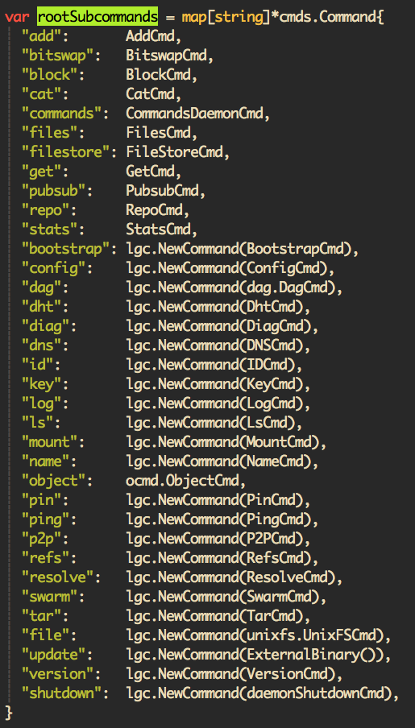

## 概述

从我个人理解，一次完整的ipfs节点使用周期，包含下面五个基本步骤，分别是初始化、启动、上传数据、获取数据、退出；通过对上述五个基本步骤的梳理，可以帮助我们系统的建立对IPFS的认识，而不是东一榔头西一铲子的去拼凑；`系统性，对于掌握一个知识体系非常有必要`；针对这5个基本步骤，大家可以不断的丰富完善，这种丰富完善包括基本步骤的丰富，例如增加基本步骤；或者基本步骤内的丰富，例如针对某个基本步骤深入进去，使其越来越丰满，越来越性感；最终通过这样一条主线，完整的串起整个IPFS知识体系；从而惠及每一位IPFS的参与者；

学习一定要系统性，系统性，系统性；

以下内容为五个基本内容的小提纲，供交流之用；

---

1. 初始化IPFS节点

   ``` 
   初始化命令：./ipfs init
   命令对应的文件入口位置：$IPFS_PATH/cmd/ipfs/ipfs.go的26行
   ```

   

   > 通过该入口位置，可以跳转到initCmd的真正实现处，实现处位于同级目录下的init.go文件中，所有的初始化操作，最终会落到init.go文件中的doInit()流程里；

   [init详细流程分析请点击此处--不断完善中](https://github.com/ChainBook/IPFS/blob/master/IPFS%E6%BA%90%E7%A0%81%E5%88%86%E6%9E%90/ipfs%20init%E5%8F%8A%E9%85%8D%E7%BD%AE%E6%96%87%E4%BB%B6%E8%AF%B4%E6%98%8E.md)

   

2. 启动IPFS节点

   ```
   启动命令：./ipfs daemon
   命令对应的文件入口位置：$IPFS_PATH/cmd/ipfs/ipfs.go的25行
   ```

   

   >通过该入口位置，可以跳转到daemonCmd的真正实现处，实现处位于同级目录下的daemon.go文件中，所有的初始化操作，最终会落到daemon.go文件中的daemonFunc()流程里；

   [daemon详细流程分析请点击此处--不断完善中](https://github.com/ChainBook/IPFS/blob/master/IPFS%E6%BA%90%E7%A0%81%E5%88%86%E6%9E%90/ipfs%20daemon%E5%90%AF%E5%8A%A8.md)

   

3. 上传数据至IPFS网络

   ```
   上传数据命令：./ipfs add ./file/name/to/ipfs
   命令对应的文件入口顺序：$IPFA_PATH/cmd/ipfs/ipfs.go的15行处有如下代码
   ```

   

   ```
   跳转至commands.Root的定义处(位于$IFPS_PATH/core/commands/root.go的第198行),可以看到Root的完整子命令定义；进入到rootSubcommands中，此处给出了ipfs所支持的所有命令，如下所示：
   ```

   

   ```
   进入AddCmd命令实现处，即可看到添加一个文件至IPFS网络的完整流程；
   ```

   [AddCmd详细流程分析请点击此处--不断完善中](https://github.com/ChainBook/IPFS/blob/master/IPFS%E6%BA%90%E7%A0%81%E5%88%86%E6%9E%90/IPFS%20ADD%E6%95%B0%E6%8D%AE%E6%B5%81%E7%A8%8B%E5%88%86%E6%9E%90.md)

​	

4. 从IPFS网络获取数据

   ```
   获取IPFS网络数据命令： ./ipfs get data-hash-value
   命令对应的文件入口顺序： 具体顺序和[3.上传数据至IPFS网络]类似，最终的实现步骤落到了子命令：GetCmd上；
   ```

   [GetCmd详细流程分析请点击此处--不断完善中](https://github.com/ChainBook/IPFS/blob/master/IPFS%E6%BA%90%E7%A0%81%E5%88%86%E6%9E%90/IPFS%20GET%E6%95%B0%E6%8D%AE%E6%B5%81%E7%A8%8B.md)


5. 退出IPFS节点

   ```
   命令：CTRL+C；收到SIGNAL后，ipfs会自动做资源回收处理，并优雅退出；
   ```

   