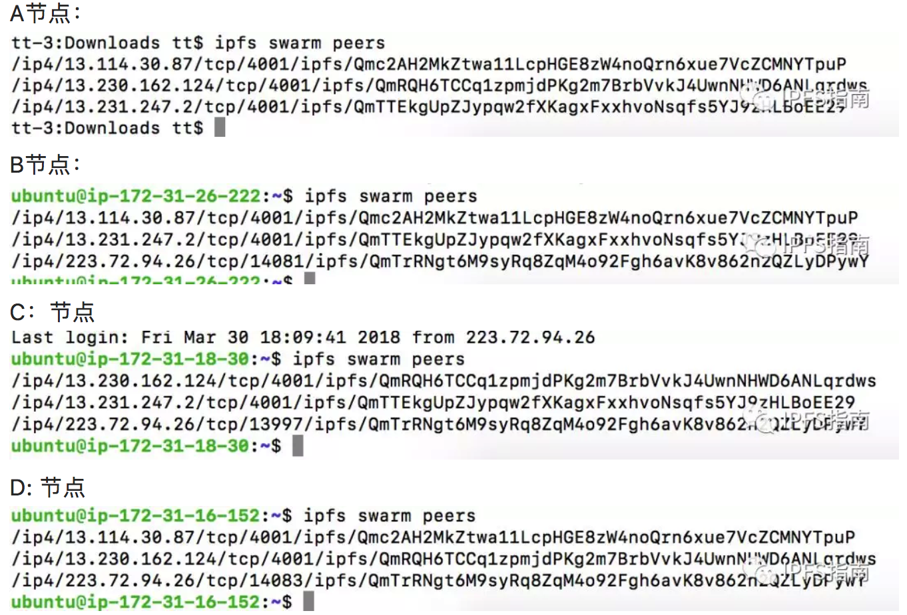

## 手动创建IPFS私有网络[天一分享]

**一 环境准备**

A：本地节点（Mac）

IP: 动态IP

ipfs 节点ID：QmTrRNgt6M9syRq8ZqM4o92Fgh6avK8v862n2QZLyDPywY

B：亚马逊AWS

IP：13.230.162.124

ipfs节点：QmRQH6TCCq1zpmjdPKg2m7BrbVvkJ4UwnNHWD6ANLqrdws

C: 亚马逊AWS

IP：13.231.247.2

ipfs 节点：QmTTEkgUpZJypqw2fXKagxFxxhvoNsqfs5YJ9zHLBoEE29

D: 亚马逊AWS

IP：13.114.30.87

ipfs节点：Qmc2AH2MkZtwa11LcpHGE8zW4noQrn6xue7VcZCMNYTpuP

**二 共享密钥**

私有网络所有的节点必须共享同一个密钥，注意不要忘记这一点。

首先我们使用密钥创建工具，创建一个密钥。

*下载地址：https://github.com/Kubuxu/go-ipfs-swarm-key-gen*

该工具的安装下载使用go。不会安装的朋友自行Google，本文不在讲解。

```
go get -u github.com/Kubuxu/go-ipfs-swarm-key-gen/ipfs-swarm-key-gen
```

然后创建密钥：

```
ipfs-swarm-key-gen > ~/.ipfs/swarm.key
```

注意：小编创建完密钥放在了自己的ipfs默认配置文件夹下面（~/.ipfs/）

**三 上传密钥到B，C，D的节点上面**

小编直接使用了scp上传到了其他三台亚马逊的服务器上面：

```
scp -i ss-server.pem ~/.ipfs/swarm.key ubuntu@13.114.30.87:~/.ipfs/
```

```
scp -i ss-server.pem ~/.ipfs/swarm.key ubuntu@13.230.162.124:~/.ipfs/
```

```
scp -i ss-server.pem ~/.ipfs/swarm.key ubuntu@13.231.247.2:~/.ipfs/
```

由于小编的亚马逊服务器ipfs节点初始化的时候都是采用的默认设置(ipfs init)

所以把密钥放到 ~/.ipfs/ 这个文件夹下面就可以了。

**四 添加启动节点**

ipfs init后的默认启动节点是连接ipfs公网的节点，如果要连接私有网络

在每一个节点执行下面的操作，删除掉所有的默认启动节点。

```
ipfs bootstrap rm —all
```

然后添加一个自己的默认节点(私有网络中的一个节点)，默认节点可以是A，B，C，D中的任何一个。

我们选取了D节点作为启动节点，在A，B，C节点执行下面的操作，把D节点的地址添加到A，B，C节点里面。

```
ipfs bootstrap add/ip4/13.114.30.87/tcp/4001/ipfs/Qmc2AH2MkZtwa11LcpHGE8zW4noQrn6xue7VcZCMNYTpuP

```

**五 启动并查看各个节点**



我们发现四个节点相互链接在了一起，这就是我们**私有ipfs网络**。小编测试的过程中发现四个节点的链接非常的快速，即便是本地节点(北京的家庭网络)和东京区域的AWS网络之间的连接也非常的快，IPFS的网络连通性依然还是这么优秀。

下面我在私有网络里面做一些简单的测试：

我们在本地节点A上面数据：

```
tt-3:Downloads tt$ ipfs add Brave-0.20.42.dmg
added QmbZ7NWHbP5edCF4BvSvfW97MdpZhcwZ3WJTp3Cd3od9Vg Brave-0.20.42.dmg12
```

在其他几个节点下载数据：

```
ubuntu@ip-172-31-26-222:~/ipfs$ ipfs get QmbZ7NWHbP5edCF4BvSvfW97MdpZhcwZ3WJTp3Cd3od9Vg
Saving file(s) to QmbZ7NWHbP5edCF4BvSvfW97MdpZhcwZ3WJTp3Cd3od9Vg
149.80 MB / 149.80 MB [=======================================] 100.00% 2m58123
```

```
ubuntu@ip-172-31-18-30:~$ ipfs get QmbZ7NWHbP5edCF4BvSvfW97MdpZhcwZ3WJTp3Cd3od9Vg
Saving file(s) to QmbZ7NWHbP5edCF4BvSvfW97MdpZhcwZ3WJTp3Cd3od9Vg
149.80 MB / 149.80 MB [=======================================] 100.00% 2m58s123
```

```
ubuntu@ip-172-31-16-152:~$ ipfs get QmbZ7NWHbP5edCF4BvSvfW97MdpZhcwZ3WJTp3Cd3od9Vg
Saving file(s) to QmbZ7NWHbP5edCF4BvSvfW97MdpZhcwZ3WJTp3Cd3od9Vg
149.80 MB / 149.80 MB [=========================================] 100.00% 2s123
```

从上面的测试可以看出来，小编首先在本地节点（Mac）上面add了文件 QmbZ7NWHbP5edCF4BvSvfW97MdpZhcwZ3WJTp3Cd3od9Vg。

然后在亚马逊的机子（位于日本东京区域）进行文件下载。150M的文件在前两个节点上面下载使用了 2分58秒。而在第三个节点上下载仅仅使用了2秒。


## 安装与初始化

下载 [go-ipfs](https://hacpai.com/forward?goto=https%3A%2F%2Fdist.ipfs.io%2F%23go-ipfs) 解压（下面的示例我是在 Windows 10 上做的，解压目录为 D:\go-ipfs），然后到解压目录执行命令 `ipfs init`，将在用户 home（~）下建立 .ipfs 目录存放数据，默认最大存储 10G。init 命令可以带参，比如修改最大存储、目录等，具体参考 `ipfs init help`。

继续执行命令 `ipfs daemon` 启动节点服务器：

- 加入 IPFS 网络
- 本地 HTTP 服务器，默认 8080 端口
- 处理后续 ipfs 的客户端命令

新开一个命令行，执行命令 `ipfs id` 以查看当前节点标识:

```
{
    "ID": "QmSYF1HZxhPUWWGrz5bMn16tdD73AeMVhp7pNSHkVCMF7R",
    "PublicKey": "....",
    "Addresses": [
      "/ip4/169.254.40.215/tcp/4001/ipfs/...",
      ....
    ],
    "AgentVersion": "go-ipfs/0.4.12/",
    "ProtocolVersion": "ipfs/0.1.0"
}

{
    "ID": "QmSYF1HZxhPUWWGrz5bMn16tdD73AeMVhp7pNSHkVCMF7R",
    "PublicKey": "....",
    "Addresses": [
      "/ip4/169.254.40.215/tcp/4001/ipfs/...",
      ....
    ],
    "AgentVersion": "go-ipfs/0.4.12/",
    "ProtocolVersion": "ipfs/0.1.0"
}
```

浏览器访问 [http://localhost:5001/webui](https://hacpai.com/forward?goto=http%3A%2F%2Flocalhost%3A5001%2Fwebui) 进入管理界面，查看系统状态、管理文件以及配置系统。

## 配置

除了使用 Web 管理界面修改配置外，也可以直接用命令行 `ipfs config show > ipfs.conf` 先导出当前配置（JSON 格式，配置项不多且含义明显），改完后使用 `ipfs config replace ipfs.conf` 更新配置，重启服务器就生效了。当然，修改配置也可以直接用 `ipfs config edit`。

服务器最终使用的配置文件保存在 ~/.ipfs/config 中，对比刚刚导出的文件我们发现导出的文件只比这个 config 少了一项 `Identity.PrivKey`，即节点初始化时自动生成的 RSA 私钥。

## 密钥对

节点初始化时会自动生成 RSA 密钥对，并且私钥没有设置密码。

公钥通过[多重哈希](https://hacpai.com/forward?goto=https%3A%2F%2Fgithub.com%2Fmultiformats%2Fmultihash)得到节点 id（即上面的 `QmSYF1HZxhPUWWGrz5bMn16tdD73AeMVhp7pNSHkVCMF7R`），节点服务器启动后会和其他节点交互公钥，后续通讯时使用对方公钥加密数据，通过多重哈希对方公钥、对比对方节点 id 来确认是否正在和正确的节点交互。

私钥用来解密接收到的数据，也用于 ipns 来绑定文件名。整个过程没有引入证书，仅是使用了 PKI 机制。

总之，我觉得可以暂时不用关心密钥对，可能只有在一些使用场景下面才需要吧。

## 添加文件

我当前目录结构是这样的：

```
D:\GO-IPFS
│  build-log
│  config
│  install.sh
│  ipfs.conf
│  ipfs.exe
│  LICENSE
│  README.md
│
└─b3log
    └─hacpai
            README.md

D:\GO-IPFS
│  build-log
│  config
│  install.sh
│  ipfs.conf
│  ipfs.exe
│  LICENSE
│  README.md
│
└─b3log
    └─hacpai
            README.md
```

我准备添加的目录是 `b3log`，执行命令：

```
D:\go-ipfs>ipfs add -r b3log
 94 B / 94 B [=============================================================================================] 100.00% 0s
added Qmco94dYP733XwrUqFUhDtDG8RsqmGQ6UDPvnmH4Pvy2rv b3log/hacpai/README.md
added Qmbkno2HVZdW7XfwsVjmuu9VDKBByczFR8qwsBXMjMrjPQ b3log/hacpai
added QmPxebZuW2pgfzj5JWq22KUzxStmqQ6i7YUK9Sq9xepXT9 b3log

D:\go-ipfs>ipfs add -r b3log
 94 B / 94 B [=============================================================================================] 100.00% 0s
added Qmco94dYP733XwrUqFUhDtDG8RsqmGQ6UDPvnmH4Pvy2rv b3log/hacpai/README.md
added Qmbkno2HVZdW7XfwsVjmuu9VDKBByczFR8qwsBXMjMrjPQ b3log/hacpai
added QmPxebZuW2pgfzj5JWq22KUzxStmqQ6i7YUK9Sq9xepXT9 b3log
```

这样我们使用 `ipfs cat /ipfs/Qmco94dYP733XwrUqFUhDtDG8RsqmGQ6UDPvnmH4Pvy2rv` 就可以查看 README.md 了。在其他节点上也可以，只要记住这个文件的哈希值就行了。我们可以在自己的 HTTP 网关上试试（注意我的端口改成了 5002，你的默认应该是 8080）：


当然也可以用 ipfs 官方的 HTTP 网关：[https://ipfs.io/ipfs/Qmco94dYP733XwrUqFUhDtDG8RsqmGQ6UDPvnmH4Pvy2rv](https://hacpai.com/forward?goto=https%3A%2F%2Fipfs.io%2Fipfs%2FQmco94dYP733XwrUqFUhDtDG8RsqmGQ6UDPvnmH4Pvy2rv)

## 获取文件

```
ipfs get /ipns/QmSYF1HZxhPUWWGrz5bMn16tdD73AeMVhp7pNSHkVCMF7R

ipfs get /ipns/QmSYF1HZxhPUWWGrz5bMn16tdD73AeMVhp7pNSHkVCMF7R
```

将获取刚才我们发布的 b3log 目录。

## Pin

IPFS 的[本意](https://hacpai.com/forward?goto=https%3A%2F%2Fipfs.io%2Fipfs%2FQmNZiPk974vDsPmQii3YbrMKfi12KTSNM7XMiYyiea4VYZ%2Fexample%23%2Fipfs%2FQmP8WUPq2braGQ8iZjJ6w9di6mzgoTWyRLayrMRjjDoyGr%2Fpinning%2Freadme.md)是让用户觉得所有文件都是在本地的，没有“从远程服务器上下载文件”。Pin 是将文件长期保留在本地，不被垃圾回收。

执行 `ipfs pin ls` 可以查看哪些文件在本地是持久化的，通过 add 添加的文件默认就是 pin 过的。

## 绑定节点名

每次修改文件后 add 都会返回不同的哈希，这对于网站来说就没法固定访问地址了，所以我们需要通过 ipns 来“绑定”节点名。

上面 b3log 目录的哈希值是 `QmPxebZuW2pgfzj5JWq22KUzxStmqQ6i7YUK9Sq9xepXT9`，我们将整个目录作为节点根目录发布：

```
D:\go-ipfs>ipfs name publish QmPxebZuW2pgfzj5JWq22KUzxStmqQ6i7YUK9Sq9xepXT9
Published to QmSYF1HZxhPUWWGrz5bMn16tdD73AeMVhp7pNSHkVCMF7R: /ipfs/QmPxebZuW2pgfzj5JWq22KUzxStmqQ6i7YUK9Sq9xepXT9

D:\go-ipfs>ipfs name publish QmPxebZuW2pgfzj5JWq22KUzxStmqQ6i7YUK9Sq9xepXT9
Published to QmSYF1HZxhPUWWGrz5bMn16tdD73AeMVhp7pNSHkVCMF7R: /ipfs/QmPxebZuW2pgfzj5JWq22KUzxStmqQ6i7YUK9Sq9xepXT9
```

然后我们就可以通过 ipns 访问了，**注意是 ipns**：

```
D:\go-ipfs>ipfs cat /ipns/QmSYF1HZxhPUWWGrz5bMn16tdD73AeMVhp7pNSHkVCMF7R/hacpai/README.md
The piper will lead us to reason.

欢迎访问黑客与画家的社区 https://hacpai.com

D:\go-ipfs>ipfs cat /ipns/QmSYF1HZxhPUWWGrz5bMn16tdD73AeMVhp7pNSHkVCMF7R/hacpai/README.md
The piper will lead us to reason.

欢迎访问黑客与画家的社区 https://hacpai.com
```

以后每次更新文件都再 publish 一下就行了。目前（v0.4.12）使用 ipns 访问[会很慢](https://hacpai.com/forward?goto=https%3A%2F%2Fgithub.com%2Fipfs%2Fgo-ipfs%2Fissues%2F3860)，据说 v0.4.14 会解决。

## DNS 解析

IPFS 允许用户使用现有的域名系统，这样就能用一个好记的地址来访问文件了，比如：

```
D:\go-ipfs>ipfs cat /ipns/ipfs.b3log.org/hacpai/README.md
The piper will lead us to reason.

欢迎访问黑客与画家的社区 https://hacpai.com

D:\go-ipfs>ipfs cat /ipns/ipfs.b3log.org/hacpai/README.md
The piper will lead us to reason.

欢迎访问黑客与画家的社区 https://hacpai.com
```

只需要在 DNS 解析加入一条 TXT 记录：

| 记录类型 | 主机记录 | 记录值                                                       |
| -------- | -------- | ------------------------------------------------------------ |
| TXT      | ipfs     | dnslink=/ipns/QmSYF1HZxhPUWWGrz5bMn16tdD73AeMVhp7pNSHkVCMF7R |

## 总结

- IPFS 是永久的、去中心化保存和共享文件的方法，这是一种内容可寻址、版本化、点对点超媒体的分布式协议
- 我们可以用它来存取文件，数据永不丢失
- 应用可以用它来做数据库，自动拥有版本化、缓存及分布式特性
- 官方参考实现使用 [golang](https://hacpai.com/tag/golang) 编写，JavaScript、Python、C 等语言在陆续开发中
- 总之，IPFS 是一套非常厉害的文件系统

 

 

 

 

 
